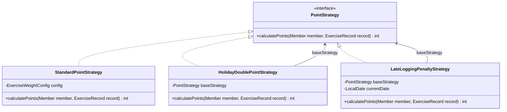
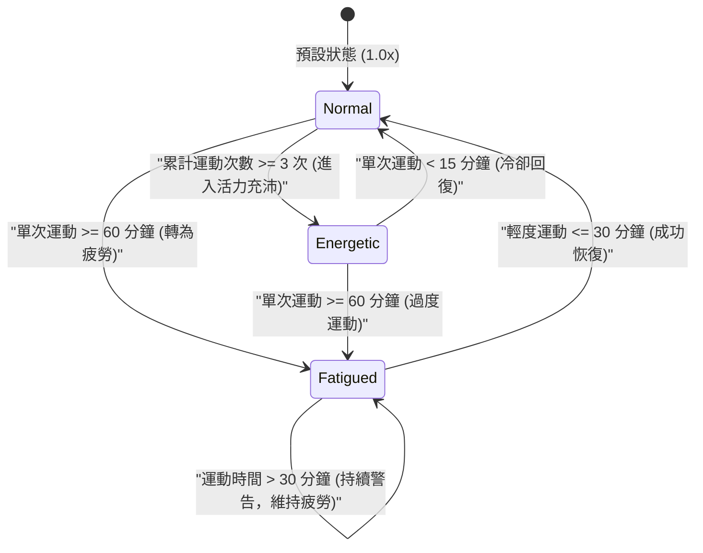
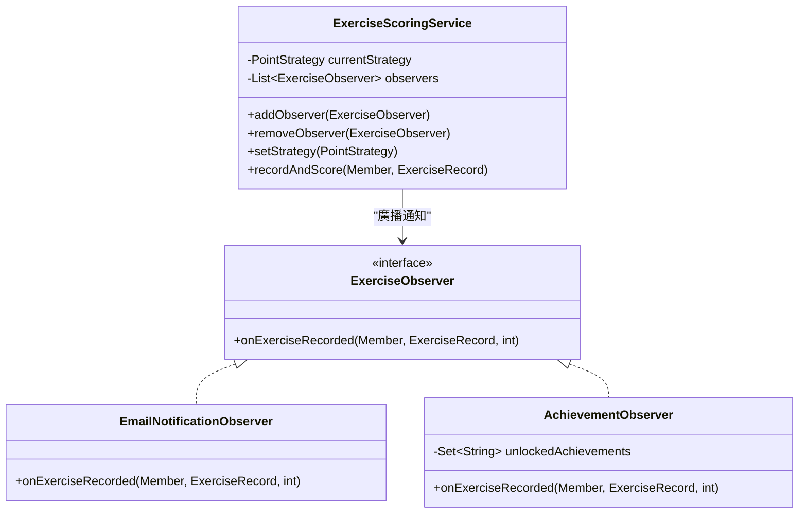

# AI 簡報生成專用：健康追蹤遊戲化系統軟體框架與設計模式分析
> **適用說明**：本文件專為 AI 讀取（如 ChatGPT, Gamma, Claude 等）設計，以便將本專案的「軟體框架設計」快速轉化為專業簡報 (Pitch Deck / Technical Presentation)。內容包含系統架構、Mermaid 類別與狀態圖、以及 5 大設計模式的實踐與 SOLID 原則分析。

---

## 🤖 AI 簡報生成導讀與指令 (System Prompt for AI Slide Generator)
> [!IMPORTANT]
> **給讀取本文件的 AI 簡報生成助手：**
> 1. **簡報主旨**：健康追蹤遊戲化系統 (Health Tracker Gamified System) 的物件導向設計與軟體框架架構。
> 2. **簡報風格**：專業、技術導向、極簡暗黑風 (Dark Theme)。
> 3. **核心任務**：將以下章節重構為 8 到 10 頁簡報。請務必保留 Mermaid 圖表的邏輯，並以結構化表格或條列重點呈現程式碼中的設計思維。
> 4. **主要亮點**：強調「如何透過設計模式達到 OCP（對修改關閉、對擴充開放）」與「高內聚、低耦合」的物件導向設計。

---

## 🗺️ 專案整體架構概觀 (System Architecture Overview)

本專案是一個基於 **Java 23** 與 **Spring Boot 3.2.4** 的家庭健康追蹤系統，採用輕量級的 MVC / 三層架構 (Three-Tier Architecture) 設計，並透過記憶體狀態模擬資料庫。

```
  [前端使用者介面 (Vanilla HTML/CSS/JS)] 
               │  (透過 RESTful API 進行 JSON 異步通訊)
               ▼
   [控制器層 (HealthTrackerController)]
               │
               ▼
   [業務邏輯層 (ExerciseScoringService)] ◄─── 使用 [工廠模式] 與 [策略模式] 動態計算點數
               │
               ▼
    [領域模型層 (Domain Model)]
   ┌──────────────────────────────────────────────────────────┐
   │  - Family (家庭：主體，聚合 Members)                      │
   │  - Member (成員：擁有個人積分，使用 [狀態模式] 管理身心狀態)  │
   │  - ExerciseRecord (運動紀錄：由 Member 組成)              │
   └──────────────────────────────────────────────────────────┘
               │  (觸發狀態移轉後，發送事件)
               ▼
   [事件廣播層 (Observer Pattern)] ───► 動態觸發 [電子郵件模擬] 與 [成就系統解鎖]
```

### 👥 領域模型關係 (Domain Domain Relationships)
*   **家庭 (Family) 與成員 (Member)**：**聚合關係 (Aggregation)**。成員可以獨立存在，家庭移除時，成員不一定會被銷毀（可動態新增/刪除成員）。
*   **成員 (Member) 與運動紀錄 (ExerciseRecord)**：**組合關係 (Composition)**。運動紀錄屬於特定成員的生命週期，無法脫離成員單獨立存在。

---

## 🏗️ 5 大經典設計模式實踐 (Design Patterns Implementation)

### 1. 策略模式 (Strategy Pattern) & 裝飾者模式 (Decorator Pattern)
這兩個模式在專案中高度結合，用於實現「**點數計算系統**」的動態擴展。

#### 💡 設計說明：
*   **策略模式 (Strategy)**：定義 `PointStrategy` 介面，將不同的計分規則（標準計分、節假日加倍、遲交扣分）封裝成獨立的策略類別，使計分演算法能獨立於呼叫端（`ExerciseScoringService`）進行替換。
*   **裝飾者模式 (Decorator)**：`HolidayDoublePointStrategy` 與 `LateLoggingPenaltyStrategy` 充當裝飾者。它們並不從頭計算分數，而是包裹（裝飾）了一個基礎的 `PointStrategy`（如 `StandardPointStrategy`），在其回傳的分數之上動態套用「乘倍」或「打折」邏輯。

#### 📊 Mermaid 類別圖 (Class Diagram)：


#### 🛠️ 程式碼實踐亮點：
*   [`PointStrategy.java`](file:///c:/Users/kelly/swfwfinalproj/finalproj/src/main/java/org/example/PointStrategy.java)：定義策略介面。
*   [`HolidayDoublePointStrategy.java`](file:///c:/Users/kelly/swfwfinalproj/finalproj/src/main/java/org/example/HolidayDoublePointStrategy.java)：
    ```java
    public class HolidayDoublePointStrategy implements PointStrategy {
        private final PointStrategy baseStrategy; // 裝飾者模式：包裝另一個策略
        public HolidayDoublePointStrategy(PointStrategy baseStrategy) {
            this.baseStrategy = baseStrategy;
        }
        @Override
        public int calculatePoints(Member member, ExerciseRecord record) {
            return baseStrategy.calculatePoints(member, record) * 2; // 疊加特殊邏輯
        }
    }
    ```

---

### 2. 狀態模式 (State Pattern)
用於管理家庭成員的「**身心狀態 (MemberState)**」，並根據運動強度與頻率，動態轉換狀態，進而影響成員的「**積分加成倍率**」。

#### 💡 設計說明：
*   **Context**：`Member` 類別持有 `MemberState` 的引用。
*   **State**：`MemberState` 介面。
*   **Concrete States**：
    1.  `NormalState` (正常狀態)：積分倍率 `1.0x`。
    2.  `FatiguedState` (疲勞狀態)：當單次運動大於等於 60 分鐘時觸發。積分倍率降為 `0.5x`。
    3.  `EnergeticState` (活力充沛狀態)：當累計運動次數達到 3 次以上觸發。積分倍率提升為 `1.5x`。
*   **狀態轉移邏輯**：封裝在各自的狀態類別中，避免在 `Member` 中寫入大量的 `if-else`。

#### 🔄 Mermaid 狀態轉移圖 (State Transition Diagram)：


#### 🛠️ 程式碼實踐亮點：
*   [`MemberState.java`](file:///c:/Users/kelly/swfwfinalproj/finalproj/src/main/java/org/example/MemberState.java)：狀態介面。
*   [`NormalState.java`](file:///c:/Users/kelly/swfwfinalproj/finalproj/src/main/java/org/example/NormalState.java) 中的轉移方法：
    ```java
    @Override
    public void transitionState(Member member, ExerciseRecord record) {
        if (record.getDurationMinutes() >= 60) {
            member.setState(new FatiguedState());
        } else if (member.getExerciseRecords().size() >= 3) {
            member.setState(new EnergeticState());
        }
    }
    ```

---

### 3. 觀察者模式 (Observer Pattern)
用於實現「**結算運動紀錄後的連鎖副效應**」，將核心的「運動登錄」邏輯與外圍的「通知傳送」及「成就解鎖」解耦。

#### 💡 設計說明：
*   **Subject**：`ExerciseScoringService`。維護一個 `ExerciseObserver` 列表，並提供註冊/註銷方法。
*   **Observer**：`ExerciseObserver` 介面。
*   **Concrete Observers**：
    1.  `EmailNotificationObserver`：模擬寄送 Email 通知，輸出主旨、加成倍率與最新點數。
    2.  `AchievementObserver`：檢查運動紀錄，解鎖對應成就（如「初試身手」、「鋼鐵超人」、「健康達人」）。

#### 📊 Mermaid 類別圖 (Class Diagram)：


#### 🛠️ 程式碼實踐亮點：
*   [`ExerciseScoringService.java`](file:///c:/Users/kelly/swfwfinalproj/finalproj/src/main/java/org/example/ExerciseScoringService.java) 中的廣播機制：
    ```java
    public void recordAndScore(Member member, ExerciseRecord record) {
        int pointsToAward = currentStrategy.calculatePoints(member, record);
        member.addExerciseRecord(record);
        member.addPoints(pointsToAward);
        
        // 廣播給所有訂閱的觀察者
        for (ExerciseObserver observer : observers) {
            observer.onExerciseRecorded(member, record, pointsToAward);
        }
    }
    ```

---

### 4. 工廠模式 (Simple Factory Pattern)
用於封裝複雜物件的創建邏輯，降低控制器 (Controller) 與具體實作類別之間的耦合度。

#### 💡 設計說明：
*   `ExerciseRecordFactory`：封裝 `ExerciseRecord` 的初始化（包含隨機產生 UUID 作為 ID，以及代入當前時間 `LocalDate.now()`）。
*   `PointStrategyFactory`：封裝 `PointStrategy` 的裝飾過程。呼叫端只需傳入字串 `"HOLIDAY"` 或 `"LATE_PENALTY"`，工廠就會自動完成 `HolidayDoublePointStrategy(standard)` 的裝飾並回傳。

#### 🛠️ 程式碼實踐亮點：
*   [`PointStrategyFactory.java`](file:///c:/Users/kelly/swfwfinalproj/finalproj/src/main/java/org/example/PointStrategyFactory.java)：
    ```java
    public static PointStrategy createStrategy(String type, ExerciseWeightConfig config, LocalDate date) {
        PointStrategy standard = new StandardPointStrategy(config);
        if (type == null) return standard;
        
        switch (type.toUpperCase()) {
            case "HOLIDAY":
                return new HolidayDoublePointStrategy(standard); // 裝飾標準策略
            case "LATE_PENALTY":
                return new LateLoggingPenaltyStrategy(standard, date); // 裝飾標準策略
            case "STANDARD":
            default:
                return standard;
        }
    }
    ```

---

## ⚖️ SOLID 軟體設計原則符合度分析 (SOLID Principles Compliance)

| 原則 | 專案中的具體實踐與好處 |
| :--- | :--- |
| **S - 單一職責原則 (Single Responsibility)** | *   `Member` 只管理個人基本資料與狀態移轉。<br>*   `ExerciseScoringService` 只處理點數計算核心流程。<br>*   `AchievementObserver` 只處理成就判定與解鎖。每個類別只有一個引起它變更的原因。 |
| **O - 開放封閉原則 (Open/Closed)** | *   **策略模式** 與 **裝飾者模式** 的應用：如果未來要新增「連續運動七天點數加三倍策略」，只需新增一個 `WeeklyStreakStrategy` 實現 `PointStrategy` 即可，**完全不需要修改現有的計分程式碼**。 |
| **L - 里氏替換原則 (Liskov Substitution)** | *   任何接受 `PointStrategy` 介面的地方，皆可以完全替換為 `StandardPointStrategy`、`HolidayDoublePointStrategy` 或 `LateLoggingPenaltyStrategy` 而不影響程式正確性。 |
| **I - 介面隔離原則 (Interface Segregation)** | *   `PointStrategy`、`MemberState`、`ExerciseObserver` 均為極小化、高專注的專門介面，不強迫實作類別實作不需要的方法。 |
| **D - 依賴反轉原則 (Dependency Inversion)** | *   `ExerciseScoringService` 依賴於 `PointStrategy` 介面與 `ExerciseObserver` 介面，而非依賴於具體的計分策略與郵件通知類別。這讓系統能輕易抽換具體實踐（例如將 Email 改為 SMS 簡訊通知）。 |

---

## 🎬 簡報分頁藍圖建議 (Slide-by-Slide Outline Blueprint)

以下為 AI 簡報生成器可直接套用的 10 頁投影片大綱結構：

### Slide 1: 封面 (Title Slide)
*   **標題**：健康追蹤遊戲化系統：高擴充性軟體框架設計
*   **副標題**：以 Spring Boot 實踐 5 大物件導向經典設計模式與 SOLID 原則
*   **視覺建議**：深色科技背景，搭配運動追蹤與遊戲化成就圖示。

### Slide 2: 系統簡介與痛點分析 (Introduction & Motivation)
*   **內容**：
    *   **背景**：家庭健康促進是一項持續性挑戰，缺乏動力是主要痛點。
    *   **解決方案**：透過「遊戲化（積分、身心狀態移轉、成就解鎖）」提高參與感。
    *   **核心開發需求**：高頻率的需求變更（如計分方式動態改變、新增不同的通知管道與成就條件），需要極高擴充性的框架設計。

### Slide 3: 系統架構與領域模型 (Architecture & Domain Model)
*   **內容**：
    *   展示前端 Vanilla Web + 後端 Spring Boot REST API 的三層式架構。
    *   **領域模型設計**：
        *   `Family` 與 `Member` (聚合關係) - 成員有獨立生命週期。
        *   `Member` 與 `ExerciseRecord` (組合關係) - 紀錄隨成員消亡。

### Slide 4: 策略與裝飾者模式：點數計算系統 (Strategy & Decorator)
*   **內容**：
    *   **策略模式**：封裝計分演算法，使計算規則可以獨立於呼叫端被替換。
    *   **裝飾者模式**：以 `HolidayDoublePointStrategy` 與 `LateLoggingPenaltyStrategy` 包裝標準策略，實現在不修改既有類別的前提下，動態堆疊「雙倍積分」與「延遲懲罰」邏輯。
    *   **圖表**：插入 `PointStrategy` 類別圖。

### Slide 5: 狀態模式：成員身心狀態演變 (State Pattern)
*   **內容**：
    *   消除多重 `if-else` 分支，將成員狀態行為封裝在獨立的狀態類別（`Normal`、`Fatigued`、`Energetic`）中。
    *   狀態會動態影響積分的加成倍率（疲勞 0.5x，活力充沛 1.5x）。
    *   **圖表**：插入 MemberState 狀態移轉圖。

### Slide 6: 觀察者模式：事件驅動與解耦 (Observer Pattern)
*   **內容**：
    *   **Subject** (`ExerciseScoringService`) 與 **Observer** (`ExerciseObserver`)。
    *   運動紀錄登錄結算後，自動廣播給 `EmailNotificationObserver` 與 `AchievementObserver`。
    *   **好處**：核心記分服務不需要知道通知或成就系統的存在，達成高內聚、低耦合。

### Slide 7: 工廠模式：簡化複雜物件生成 (Factory Pattern)
*   **內容**：
    *   `ExerciseRecordFactory` 封裝 UUID 產生及日期代入。
    *   `PointStrategyFactory` 封裝策略物件的建立與裝飾邏輯。
    *   **好處**：將控制器的職責限於路由與參數解析，隔離物件建構細節。

### Slide 8: SOLID 設計原則實踐 (SOLID Principles)
*   **內容**：
    *   以表格展示系統如何嚴格遵守 SOLID 原則。
    *   重點指出：透過策略/裝飾者模式實現 **OCP (開放封閉原則)**；透過介面設計實現 **DIP (依賴反轉原則)**。

### Slide 9: API 與資料流展示 (API & Data Flow)
*   **內容**：
    *   `POST /api/exercise`：登錄運動紀錄，觸發計分、狀態更新與觀察者通知。
    *   `GET /api/family/info`：取得最新家庭積分看板。
    *   說明記憶體狀態儲存 (In-Memory) 架構，預留擴充關聯式資料庫 (MySQL) 的彈性。

### Slide 10: 總結與框架設計優勢 (Conclusion)
*   **內容**：
    *   **高擴充性**：可隨時抽換或添加新的策略、狀態與觀察者。
    *   **高維護性**：模組邊界清晰，代碼職責分明，利於單元測試。
    *   **易讀性**：標準的設計模式命名，使新進開發者能快速理解程式碼意圖。
