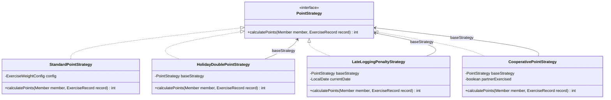
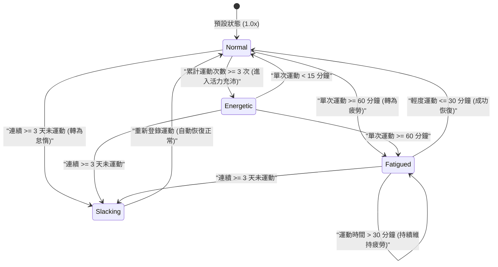
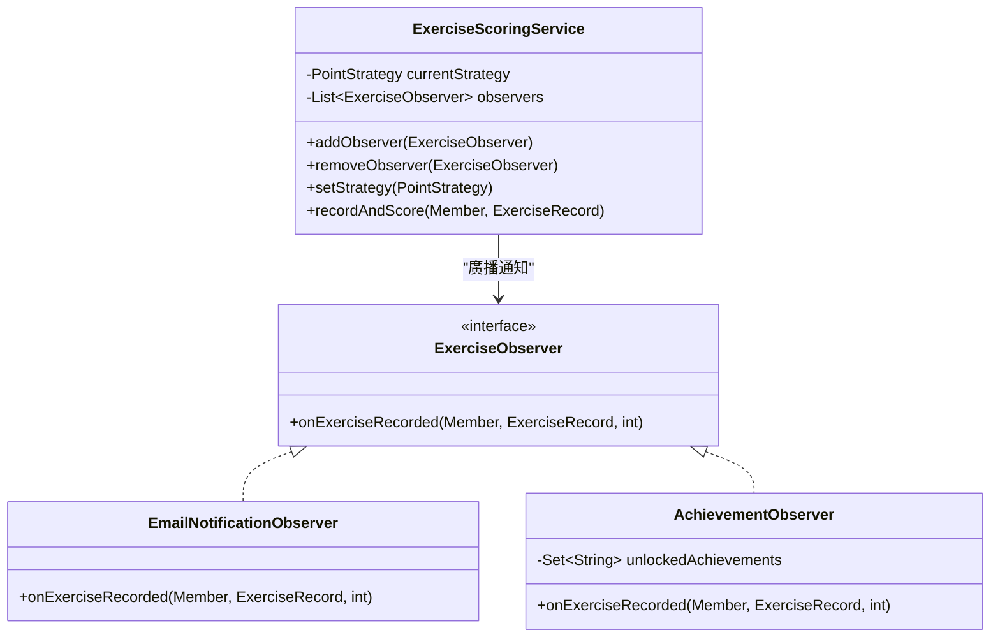

# 🏆 健康追蹤遊戲化系統：軟體框架設計與設計模式深度剖析
> **適用說明**：本文件專為 AI 讀取（如 ChatGPT, Gamma, Claude 等）設計，以便將本專案的「軟體框架設計」快速轉化為專業、學術性強的技術簡報 (Technical Presentation)。內容聚焦於物件導向設計原則、設計模式實踐、系統擴充性設計以及 SOLID 原則分析。

---

## 🤖 AI 簡報生成導讀與指令 (System Prompt for AI Slide Generator)
> [!IMPORTANT]
> **給讀取本文件的 AI 簡報生成助手：**
> 1. **簡報主旨**：健康追蹤遊戲化系統 (Health Tracker Gamified System) 的物件導向設計與軟體框架架構。
> 2. **簡報風格**：專業、技術導向、極簡暗黑風 (Dark Theme)。
> 3. **核心焦點**：請將重點完全放在**「軟體框架設計」、「設計模式的架構優勢」與「物件導向設計原則 (SOLID)」**上。請避免過度描述具體的業務點數數值，而是強調模式如何解決擴充性、高內聚低耦合的工程挑戰。
> 4. **主要亮點**：強調裝飾者模式如何動態疊加行為，以及狀態模式如何透過狀態轉移物件消除 Context 的條件判斷分支。

---

## 🗺️ 專案整體架構設計 (System Architecture & Domain Relationships)

本專案採用輕量級的 MVC / 三層架構 (Three-Tier Architecture) 設計，並透過記憶體狀態模擬資料庫。

```
  [前端使用者介面 (Vanilla HTML/CSS/JS)] 
               │  (透過 RESTful API 進行 JSON 異步通訊)
               ▼
   [控制器層 (HealthTrackerController)] ◄── 職責限制於路由分發與參數解析
               │
               ▼
   [業務邏輯層 (ExerciseScoringService)] ◄── 核心業務流程控制器 (Score Processing Engine)
               │
               ▼
    [領域模型層 (Domain Model)]
   ┌──────────────────────────────────────────────────────────┐
   │  - Family (家庭：主體，聚合 Members)                      │
   │  - Member (成員：擁有個人積分，使用 [狀態模式] 管理身心狀態)  │
   │  - ExerciseRecord (運動紀錄：由 Member 組成，保存實得分數)    │
   └──────────────────────────────────────────────────────────┘
               │  (觸發狀態移轉後，發送事件)
               ▼
   [事件廣播層 (Observer Pattern)] ───► 動態觸發 [電子郵件模擬] 與 [成就系統解鎖]
```

### 👥 領域模型關係 (Domain Domain Relationships)
*   **家庭 (Family) 與成員 (Member)**：**聚合關係 (Aggregation)**。成員可以獨立存在，家庭移除時，成員不一定會被銷毀（可動態新增/刪除成員）。
*   **成員 (Member) 與運動紀錄 (ExerciseRecord)**：**組合關係 (Composition)**。運動紀錄屬於特定成員的生命週期，無法脫離成員單獨立存在。

---

## 🏗️ 5 大經典設計模式實踐 (Design Patterns Implementation)

### 1. 策略模式 (Strategy Pattern) & 裝飾者模式 (Decorator Pattern)
這兩個模式在專案中高度結合，用於實現「**點數計算系統**」的動態擴展。

#### 💡 設計說明：
*   **策略模式 (Strategy)**：定義 `PointStrategy` 介面，將不同的計分規則（標準計分、節假日加倍、遲交扣分、雙人同行）封裝成獨立的策略類別，使計分演算法能獨立於呼叫端（`ExerciseScoringService`）進行替換。
*   **裝飾者模式 (Decorator)**：以 `HolidayDoublePointStrategy`、`LateLoggingPenaltyStrategy` 與 `CooperativePointStrategy` 充當裝飾者。它們並不從頭計算分數，而是包裹（裝飾）了一個基礎的 `PointStrategy`（如 `StandardPointStrategy`），在執行期 (Runtime) 動態套用特殊規則（如點數加倍、折半、加成）。這使系統能靈活組合多種策略（例如：當天有他人運動且是假日且是補登：`Penalty(Holiday(Cooperative(Standard)))`）。

#### 📊 Mermaid 類別圖 (Class Diagram)：


#### 🛠️ 程式碼實踐亮點：
*   [`CooperativePointStrategy.java`](file:///c:/Users/kelly/swfwfinalproj/finalproj/src/main/java/org/example/CooperativePointStrategy.java)：
    ```java
    public class CooperativePointStrategy implements PointStrategy {
        private final PointStrategy baseStrategy; // 裝飾者模式：包裝另一個基礎策略
        private final boolean partnerExercised;
        
        public CooperativePointStrategy(PointStrategy baseStrategy, boolean partnerExercised) {
            this.baseStrategy = baseStrategy;
            this.partnerExercised = partnerExercised;
        }
        @Override
        public int calculatePoints(Member member, ExerciseRecord record) {
            int basePoints = baseStrategy.calculatePoints(member, record);
            // 當判定符合協力條件時，裝飾者會在原基礎點數之上動態加乘 20%
            return partnerExercised ? (int) (basePoints * 1.2) : basePoints;
        }
    }
    ```

---

### 2. 狀態模式 (State Pattern)
用於管理家庭成員的「**身心狀態 (MemberState)**」，並根據運動強度與頻率，動態轉換狀態，進而影響成員的「**積分加成倍率**」。

#### 💡 設計說明：
*   **Context**：`Member` 類別持有 `MemberState` 的引用。
*   **State**：`MemberState` 介面。
*   **Concrete States**：
    1.  `NormalState` (正常狀態)：積分倍率 `1.0x`。
    2.  `FatiguedState` (疲勞狀態)：積分倍率 `0.5x`。
    3.  `EnergeticState` (活力充沛狀態)：積分倍率 `1.5x`。
    4.  `SlackingState` (怠惰中狀態)：積分倍率 `0.5x`。
*   **狀態轉移邏輯**：狀態移轉逻辑被封裝在各狀態子類別中。Context (`Member`) 不需要包含任何複雜的 `if-else` 或 `switch` 分支，只需委託當前的狀態物件來處理轉移，實現高凝聚度。

#### 🔄 Mermaid 狀態轉移圖 (State Transition Diagram)：


#### 🛠️ 程式碼實踐亮點：
*   [`NormalState.java`](file:///c:/Users/kelly/swfwfinalproj/finalproj/src/main/java/org/example/NormalState.java) 中的轉移方法：
    ```java
    @Override
    public void transitionState(Member member, ExerciseRecord record) {
        if (record.getDurationMinutes() >= 60) {
            member.setState(new FatiguedState());
        } else if (member.getExerciseRecords().size() >= 3) {
            member.setState(new EnergeticState());
        }
    }
    ```

---

### 3. 觀察者模式 (Observer Pattern)
用於實現「**結算運動紀錄後的連鎖副效應**」，將核心的「運動登錄」邏輯與外圍的「通知傳送」及「成就解鎖」解耦。

#### 💡 設計說明：
*   **Subject**：`ExerciseScoringService`。維護一個 `ExerciseObserver` 列表，並提供註冊/註銷方法。
*   **Observer**：`ExerciseObserver` 介面。
*   **Concrete Observers**：
    1.  `EmailNotificationObserver`：模擬寄送 Email 通知，輸出主旨、加成倍率與最新點數。
    2.  `AchievementObserver`：檢查運動紀錄，解鎖對應成就（如「初試身手」、「鋼鐵超人」、「健康達人」）。

#### 📊 Mermaid 類別圖 (Class Diagram)：


---

### 4. 工廠模式 (Simple Factory Pattern)
用於封裝複雜物件的創建邏輯，降低控制器 (Controller) 與具體實作類別之間的耦合度。
*   `ExerciseRecordFactory`：封裝 `ExerciseRecord` 的初始化（包含隨機產生 UUID 作為 ID，以及代入當前時間 `LocalDate.now()`）。
*   `PointStrategyFactory`：封裝 `PointStrategy` 的裝飾過程。呼叫端只需傳入字串 `"HOLIDAY"` 或 `"LATE_PENALTY"`，工廠就會自動完成 `HolidayDoublePointStrategy(standard)` 的裝飾並回傳。

---

## ⚖️ SOLID 軟體設計原則符合度分析 (SOLID Principles Compliance)

| 原則 | 專案中的具體實踐與好處 |
| :--- | :--- |
| **S - 單一職責原則 (Single Responsibility)** | *   `Member` 只管理個人基本資料與狀態移轉。<br>*   `ExerciseScoringService` 只處理點數計算核心流程。<br>*   `AchievementObserver` 只處理成就判定與解鎖。每個類別只有一個引起它變更的原因。 |
| **O - 開放封閉原則 (Open/Closed)** | *   **策略模式** 與 **裝飾者模式** 的應用：如果未來要新增「連續運動七天點數加三倍策略」，只需新增一個 `WeeklyStreakStrategy` 實現 `PointStrategy` 即可，**完全不需要修改現有的計分程式碼**。 |
| **L - 里氏替換原則 (Liskov Substitution)** | *   任何接受 `PointStrategy` 介面的地方，皆可以完全替換為 `StandardPointStrategy`、`HolidayDoublePointStrategy`、`LateLoggingPenaltyStrategy` 或 `CooperativePointStrategy` 裝飾者而不影響程式正確性。 |
| **I - 介面隔離原則 (Interface Segregation)** | *   `PointStrategy`、`MemberState`、`ExerciseObserver` 均為極小化、高專注的專門介面，不強迫實作類別實作不需要的方法。 |
| **D - 依賴反轉原則 (Dependency Inversion)** | *   `ExerciseScoringService` 依賴於 `PointStrategy` 介面與 `ExerciseObserver` 介面，而非依賴於具體的計分策略與郵件通知類別。這讓系統能輕易抽換具體實踐（例如將 Email 改為 SMS 簡訊通知）。 |

---

## 🔌 框架之變動點與擴充點分析 (Frozen Spots vs. Hot Spots)

為了將本專案提煉為一個通用的**遊戲化引擎框架**，我們分析了以下系統架構：

1.  **變動點 (Hot Spots — 常因業務規則改變而需調整的部分)**：
    *   **計分公式與係數**：基礎點數權重應抽離至設定檔 (`application.yml`) 中。
    *   **狀態轉移門檻值**：諸如連擊天數、疲勞分鐘數，應由 Spring `@Value` 進行動態注入。
2.  **擴充點 (Extension Points — 提供給開發者自訂的接口)**：
    *   `PointStrategy`：開發者可隨時新增各種複雜的計分規則。
    *   `MemberState`：開發者可自訂新的身心狀態。
    *   `ExerciseObserver`：開發者可動態註冊如數據庫寫入、Line 通知、實體手環同步等副效應。

---

## 🎬 簡報分頁藍圖建議 (Slide-by-Slide Outline Blueprint)

以下為 AI 簡報生成器可直接套用的 10 頁投影片大綱結構：

### Slide 1: 封面 (Title Slide)
*   **標題**：健康追蹤遊戲化系統：高擴充性軟體框架設計
*   **副標題**：以 Spring Boot 實踐 5 大物件導向經典設計模式與 SOLID 原則
*   **視覺建議**：深色科技背景，搭配類別關係與狀態圖示。

### Slide 2: 系統簡介與架構痛點 (Introduction & Architectural Challenges)
*   **內容**：
    *   **挑戰**：家庭健康遊戲化系統需求多變（如計分方式動態改變、新增不同的通知管道與成就條件）。
    *   **痛點**：硬編碼容易造成代碼臃腫（如多重 if-else）與高度耦合。
    *   **目標**：設計一個具備高可維護性、高擴充性的物件導向軟體框架。

### Slide 3: 系統架構與領域模型 (Architecture & Domain Model)
*   **內容**：
    *   展示前端 Vanilla Web + 後端 Spring Boot REST API 的三層式架構。
    *   **領域模型設計**：
        *   `Family` 與 `Member` (聚合關係) - 成員有獨立生命週期。
        *   `Member` 與 `ExerciseRecord` (組合關係) - 紀錄隨成員消亡。

### Slide 4: 策略模式：封裝多變的計分規則 (Strategy Pattern)
*   **內容**：
    *   **問題**：不同的運動種類與補登錄時間需要不同的計分公式。
    *   **解決方案**：定義 `PointStrategy` 介面，將 `Standard` 計分法封裝為具體策略。
    *   **優勢**：使計算規則可以獨立於呼叫端（`ExerciseScoringService`）進行替換。

### Slide 5: 裝飾者模式：動態疊加策略行為 (Decorator Pattern)
*   **內容**：
    *   **問題**：計分規則需要動態組合（例如：假日 + 遲交懲罰 + 雙人同行）。
    *   **解決方案**：使用 `HolidayDouble`、`LateLogging` 與 `Cooperative` 作為裝飾者包裝基礎策略。
    *   **優勢**：實現在不修改既有類別的前提下，以「包裝」方式動態疊加多重計分規則，落實 OCP 原則。
    *   **圖表**：插入 `PointStrategy` 裝飾者類別圖。

### Slide 6: 狀態模式：成員狀態轉移解耦 (State Pattern)
*   **內容**：
    *   **問題**：成員狀態（正常、疲勞、活力、怠惰）會隨運動歷史改變，若在 Member 中判斷會造成龐大的 `if-else` 分支。
    *   **解決方案**：將狀態行為與轉換邏輯封裝在獨立的狀態子類別（`Normal`、`Fatigued`、`Energetic`、`Slacking`）中。
    *   **優勢**：Member 只需持有狀態介面引用並委派執行，消除條件分支，提升代碼內聚性。
    *   **圖表**：插入 MemberState 狀態移轉圖。

### Slide 7: 觀察者模式：事件驅動與業務解耦 (Observer Pattern)
*   **內容**：
    *   **問題**：點數結算後需執行發送通知與解鎖成就，若寫在計分服務中會造成嚴重耦合。
    *   **解決方案**：`ExerciseScoringService` 作為 Subject，廣播事件給多個 `ExerciseObserver` 訂閱者。
    *   **優勢**：結算服務無須關注外圍通知的實作細節，輕易實現低耦合。
    *   **圖表**：插入 Observer 類別圖。

### Slide 8: 工廠模式：隔離物件建構細節 (Factory Pattern)
*   **內容**：
    *   **問題**：控制器（Controller）若直接實例化各類複雜策略與運動紀錄，會增加層次間的耦合。
    *   **解決方案**：利用 `PointStrategyFactory` 與 `ExerciseRecordFactory` 封裝實例化細節。
    *   **優勢**：集中管理物件創建邏輯，簡化調用端代碼。

### Slide 9: SOLID 設計原則實踐總結 (SOLID Principles)
*   **內容**：
    *   以表格展示系統如何嚴格遵守 SOLID 五大原則。
    *   重點指出：策略/裝飾者模式完美實踐 **OCP (開放封閉原則)**；計分與通知委派介面完美實踐 **DIP (依賴反轉原則)**。

### Slide 10: 軟體框架化與未來擴充方向 (Framework Extensibility)
*   **內容**：
    *   **變動點 (Hot Spots)** 與 **擴充點 (Frozen Spots)** 的清晰分離。
    *   **泛化設計**：將運動概念泛化為「遊戲事件」，使其能抽離為通用的遊戲化引擎。
    *   **結論**：優秀的框架設計是應對多變需求、確保系統長久生命力的核心基石。
